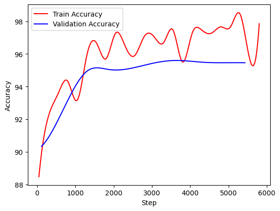
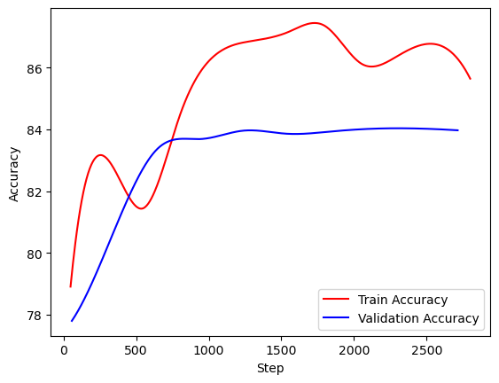
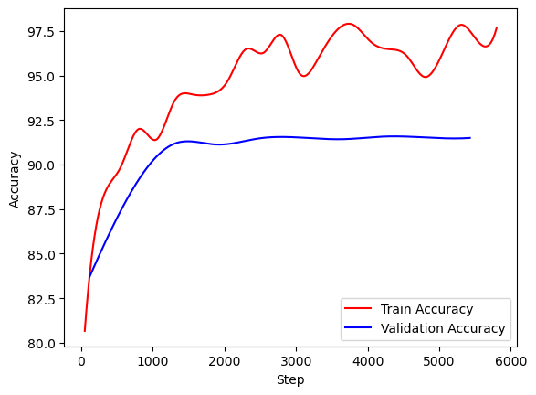
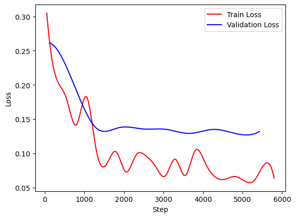
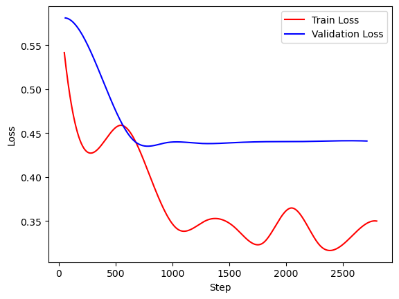
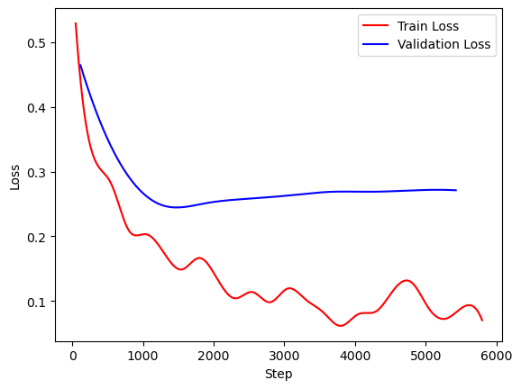

<p align="center">
  <a href="" rel="noopener">
 </a>
</p>

<h3 align="center">Augment Aid</h3>


<p align="center"> Augment Aid is a machine learning project focused on data augmentation techniques. The project aims to enhance the performance of machine learning models by artificially expanding the training dataset. Augment Aid can generate new, diverse examples that help improve model robustness and generalization by applying various transformations to the existing data.
    <br> 
</p>

## 📝 Table of Contents

- [About](#about)
- [Quick Start](#quick_start)
- [Getting Started](#getting_started)
- [Usage](#usage)
- [Built Using](#built_using)
- [Documentation](#documentation)
- [Authors](#authors)

## 🧐 About <a name = "about"></a>

Data augmentation is the process of artificially generating new data from existing data, primarily to train new machine
learning (ML) models. ML models require large and varied datasets for initial training, but sourcing sufficiently
diverse real-world datasets can be challenging because of data silos, regulations, and other limitations. Data
augmentation artificially increases the dataset by making small changes to the original data.

AugmentAid implements two data augimentation tehniques emplying a <b><i>Generative Adversarial Network(GAN)</i></b> and
an <b><i>Variational AutoEncoder</i></b> to generate new images similar to the <b>FashionMNIST</b> dataset images in
order to asses the impact of this techniques on a simple classification model.

## ⚡ Quick Start <a name="quick_start"></a>

Want to play with these notebooks online without having to install anything? You can use Google Colab:
  [](https://colab.research.google.com/github/gabriel-rusu/augment-aid-ml/blob/main/src/notebooks/colab-training.ipynb)

<b>WARNING:</b> Please be aware that these services provide temporary environments: anything you do will be deleted
after a while, so make sure you download any data you care about.

## 🏁 Getting Started <a name = "getting_started"></a>

These instructions will get you a copy of the project up and running on your local machine for development and testing
purposes.

### Installing

To run the project you must first create a dedicated conda environment. You can do this 
by running on of the following commands based on your platform:
- Windows/Linux:
  ```bash
    conda env create -f environment.yml -y
    ```
- MacOS
    ```bash
    conda env create -f environment-macos.yml -y
    ```
  
After the previous command finished executing you should have 
a new ___augment-aid___ conda environment. If something gone wrong or you run the wrong command you can use the following 
command to delete the previously created environment and repeat the first step
```bash
conda remove -y --name augment-aid --all
```
The final step is to run the following command:
```bash
pip install -v -e .
```
If all commands run smoothly you can now run/modify any notebook
form the project.

## 🎈 Usage <a name="usage"></a>

The results of using the GAN and VAE are displayed bellow. After training both to generate 
new training examples in results in classification accuracy/loss are displayed bellow
- The following 3 graphs display in order from left to right the classifier loss when I trained the classifier with GAN, VAE and no data augmentation
<div style="display: flex; flex-wrap: wrap; padding: 0 4px">
  <div style="flex: 50%; padding: 0 4px">
    
    
    
  </div>
</div>

- The following 3 graphs display in order from left to right the classifier loss when I trained the classifier with GAN, VAE and no data augmentation
<div style="display: flex; flex-wrap: wrap; padding: 0 4px">
  <div style="flex: 50%; padding: 0 4px">
    
    
    
  </div>
</div>

If you want to apply data augmentation to your classifier you can start by replacing in the notebooks the simple 
ResNet 18 classifier used by me, with the classifier you want to use. After replacing the classifier you can implement 
your own datamodule to handle your dataset and the notebooks should start training your classifier with and without data
augmentation.

#### Suggested order of running the notebooks:
- [image-classification](src/notebooks/image-classification.ipynb)
- [gan-training](src/notebooks/gan-training.ipynb)
- [gan-enhanced-image-classification](src/notebooks/gan-enhanced-image-classification.ipynb)
- [vae-training](src/notebooks/vae-training.ipynb)
- [vae-enhanced-image-classification](src/notebooks/vae-enhanced-image-classification.ipynb)

## ⛏️ Built Using <a name = "built_using"></a>

- [PyTorch](https://pytorch.org/) - machine learning framework
- [PyTorch Lightning](https://lightning.ai/docs/pytorch/stable/) - deep learning framework
- [Jupyter Notebook](https://jupyter.org/) - web application for creating and sharing computational documents

## 📑 Documentation <a name="documentation"></a>

- [Generative Adversarial Nets](https://arxiv.org/pdf/1406.2661)
- [Auto-Encoding Variational Bayes](https://arxiv.org/pdf/1312.6114)
- [Image Data Augmentation for Deep Learning: A Survey](https://arxiv.org/pdf/2204.08610)
- [The Effectiveness of Data Augmentation in Image Classification using Deep Learning](https://arxiv.org/pdf/1712.04621)

## ✍️ Authors <a name = "authors"></a>

- [@gabriel-rusu](https://github.com/gabriel-rusu) - Idea & Initial work
